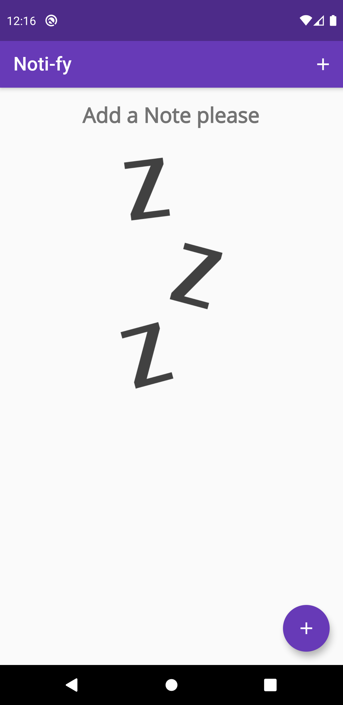
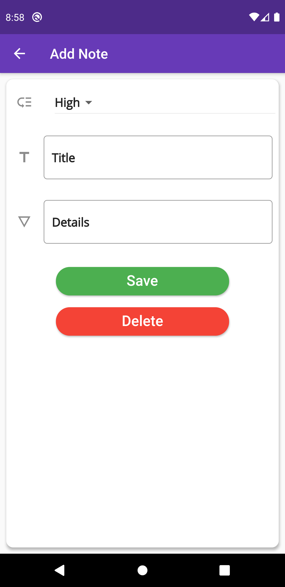
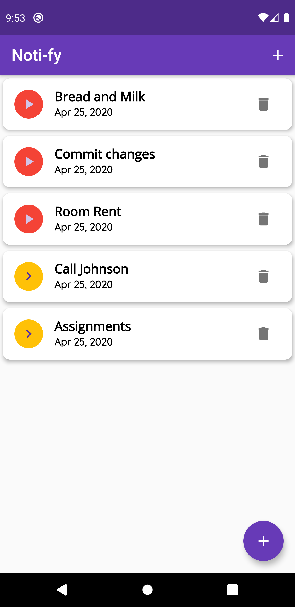

# Noti-fy 📝

A very Minimal Yet Simple TODO App that helps you keeping track of your activities.

Show some love by ⭐️  this repository if you liked it.

## Getting Started 🚀
Run the project on Your local Machine:-
- Clone the repo
- Install the dependicies
- Run it
## Features ✅
 Some of The Features of the App:-
 
- Local Data storage using SQflite.
- CRUD Operations working.
- Notes based on Priority.
- Minimal UI

## Preview 📸

|                                           |                                           |                                           |
| ----------------------------------------- | ----------------------------------------- | ----------------------------------------- |
|  |  |  |
## Contribution
This is a complete open source project you can make any improvements,add a new feature,Tweak something little-bit and then
Send a PR.

## Contact me 📧
Drop me a mail if you are intrested to have a conversation.

#### Email : hiteshgarg285@gmail.com
